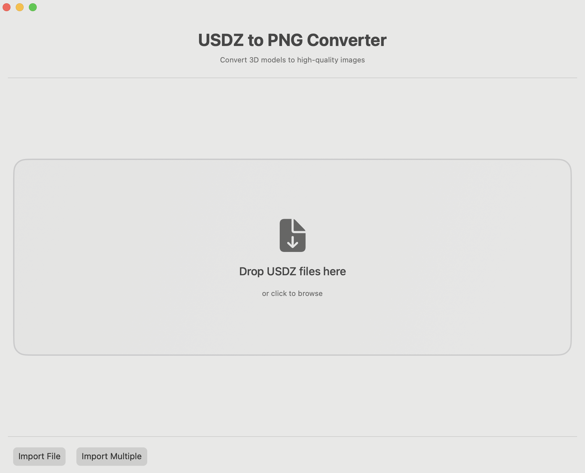
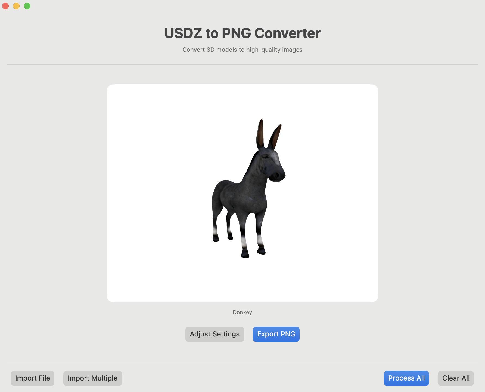
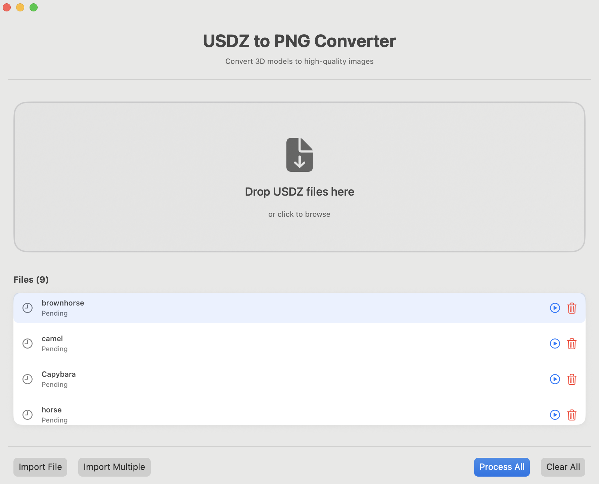
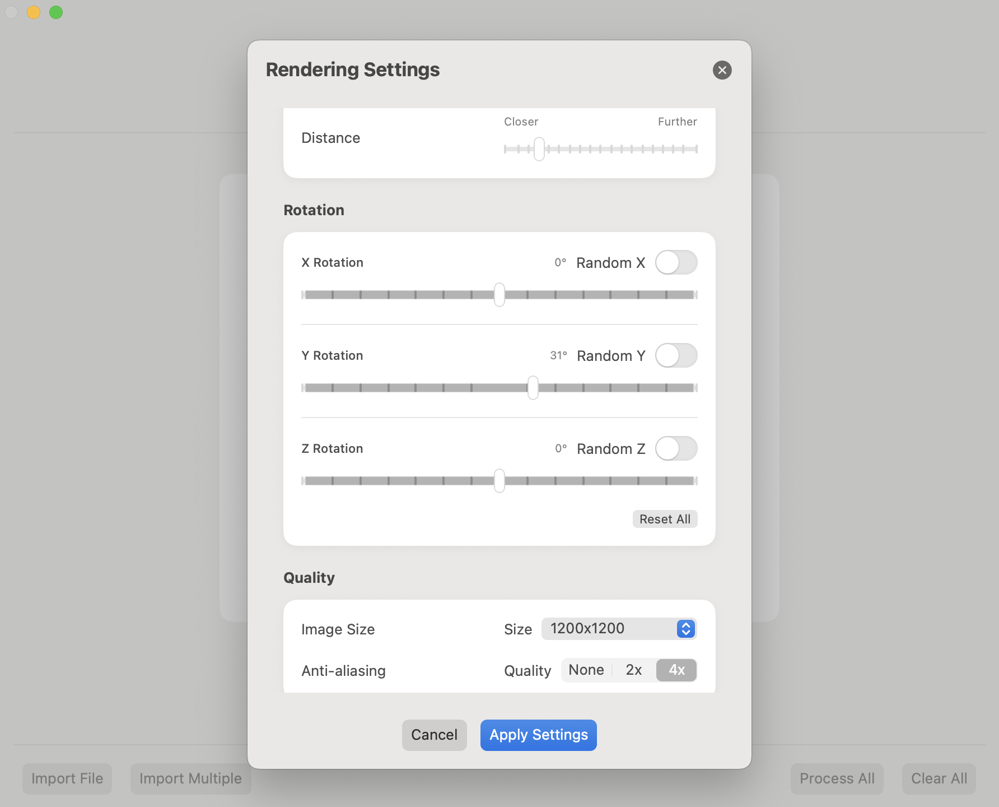

# USDZtoPNG

A powerful, modern macOS application that converts USDZ 3D model files to high-quality PNG images with professional rendering, advanced lighting, and precise control over camera positioning and model rotation.

[](https://www.apple.com/macos/)
[](https://swift.org/)
[](https://developer.apple.com/swiftui/)
[](https://en.wikipedia.org/wiki/Model%E2%80%93view%E2%80%93viewmodel)
[](LICENSE)

## 🎯 Overview

USDZtoPNG bridges the gap between 3D content creation and 2D presentation needs with professional-grade rendering capabilities. Whether you're working in e-commerce, creating product documentation, or preparing marketing materials, this app provides a seamless way to generate studio-quality images from USDZ 3D models with precise control over every aspect of the rendering process.

## ✨ Key Features

### 🎮 **Advanced Rotation Controls**
- **Individual Axis Control**: Separate X, Y, Z rotation sliders (-180° to +180°)
- **Random Rotation Options**: Toggle random rotation for each axis independently
- **Mixed Mode Support**: Combine manual and random rotations (e.g., fixed X/Z, random Y)
- **Real-time Degree Display**: Live feedback showing exact rotation values
- **One-Click Reset**: Instantly return all rotations to default settings

### 🎯 **Core Functionality**
- **Modern Drag & Drop Interface**: Simply drop USDZ files onto the app
- **Batch Processing**: Convert multiple files simultaneously with progress tracking
- **High-Quality Output**: 1200x1200 resolution with 4x multisampling antialiasing
- **Real-time Preview**: See results before exporting with live camera adjustments

### 📐 **Camera & Positioning**
- **Smart Auto-Positioning**: Automatic camera distance based on model bounding sphere
- **Manual Distance Control**: Fine-tune viewing distance with precision slider
- **Optimal Framing**: Models automatically centered and properly scaled
- **Look-At Constraints**: Camera always focuses on model center

### 🔧 **Advanced Settings**
- **Flexible Camera Distance**: 1x to 10x multiplier with 0.5 step precision
- **Quality Controls**: Multiple antialiasing options (None, 2x, 4x)
- **Output Formats**: PNG, JPEG, TIFF support with quality settings
- **Background Options**: Customizable background colors

## 📱 Screenshots

### Main Interface

*Clean, modern interface with drag-and-drop functionality and real-time preview*

### Rendered Output Preview

*High-quality rendered output with professional lighting and precise rotation control*

### File Import Options

*Multiple import options including drag-and-drop and file browser integration*

### Advanced Settings Panel

*Comprehensive camera, rotation, and quality controls in an intuitive settings interface*

## 🚀 Getting Started

### Prerequisites

- **macOS 14.0 (Sonoma)** or later
- **Xcode 15.0+** (for building from source)
- USDZ files to convert (supports all standard USDZ formats)

### Installation

#### Option 1: Download Release (Recommended)
1. Download the latest release from the [Releases](../../releases) page
2. Drag `USDZtoPNG.app` to your Applications folder
3. Launch the app and grant necessary permissions when prompted

#### Option 2: Build from Source
1. Clone this repository:
   ```bash
   git clone https://github.com/yourusername/USDZtoPNG.git
   cd USDZtoPNG
   ```

2. Open the project in Xcode:
   ```bash
   open USDZtoPNG.xcodeproj
   ```

3. Select your development team in **Signing & Capabilities**

4. Build and run the project (`⌘R`)

## 🎮 Usage Guide

### Single File Conversion
1. **Launch** USDZtoPNG
2. **Import** a USDZ file by:
   - Dragging and dropping onto the app window, or
   - Using the import button to browse for files
3. **Preview** the rendered result in real-time
4. **Adjust Settings** (optional):
   - Camera distance for closer/further views
   - Individual X, Y, Z rotations for perfect angles
   - Enable random rotation on specific axes
5. **Export** by clicking "Export PNG" and choosing save location

### Advanced Rotation Control
- **Manual Rotation**: Use individual sliders for precise X, Y, Z positioning
- **Random Rotation**: Toggle random rotation for any combination of axes
- **Mixed Mode**: Set some axes manually while others randomize
- **Real-time Feedback**: See degree values update as you adjust
- **Quick Reset**: Use "Reset All" to return to default orientation

### Batch Processing
1. Click **"Import Multiple"** or drag multiple USDZ files simultaneously
2. **Configure Settings** that will apply to all files
3. **Select Output Directory** for batch export
4. **Monitor Progress** with real-time processing indicators
5. **Review Results** in the completion summary

### Camera & Quality Settings
- **Distance Control**: Adjust how close the camera is positioned (1x-10x)
- **Quality Options**: Choose antialiasing level (None/2x/4x)
- **Output Format**: Select PNG, JPEG, or TIFF with quality settings
- **Background**: Customize background color for your renders

## 🔧 Technical Details

### Modern Architecture
- **Framework**: SwiftUI with modern async/await patterns
- **Architecture**: MVVM with dedicated ViewModels and Services
- **3D Rendering**: SceneKit with custom lighting and camera systems
- **File Handling**: UniformTypeIdentifiers for robust USDZ support
- **Security**: App Sandbox with user-selected file access
- **Concurrency**: Actor-isolated rendering for thread safety

### Professional Rendering Pipeline
1. **Scene Loading**: Parse USDZ with comprehensive error handling
2. **Model Analysis**: Calculate optimal bounding sphere and dimensions
3. **Content Positioning**: Smart centering and scaling algorithms
4. **Lighting Setup**: Configure 6-light professional studio system
5. **Camera Positioning**: Set distance and constraints based on model size
6. **Rotation Application**: Apply manual and/or random rotations per axis
7. **High-Quality Render**: Generate images with advanced antialiasing
8. **Format Export**: Convert to selected format with quality settings

### Performance Optimizations
- **Background Processing**: All rendering operations off main thread
- **Memory Management**: Efficient handling of large 3D models and textures
- **Component Isolation**: Prevent unnecessary UI re-renders
- **Lazy Loading**: Efficient list rendering for large file collections

## 📄 License

This project is licensed under the MIT License - see the [LICENSE](LICENSE) file for details.

## 🎯 Why Choose USDZtoPNG?

- **Professional Results**: Studio-quality renders out of the box
- **Total Control**: Control over every aspect of rendering
- **Performance Focused**: Optimized for speed and efficiency
- **User Friendly**: Complex 3D rendering made simple
- **Future Proof**: Continuously updated with latest features

---

**Made with ❤️ for the 3D content community**

*Transform your USDZ models into stunning images with professional precision and creative control.* 